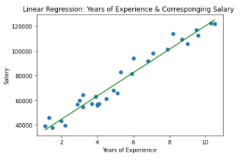
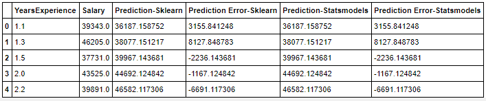
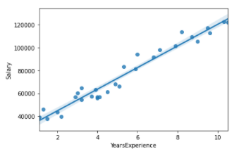

# Simple Linear Regression: Salary Prediction

This Simple Linear Regression is a fictional case study based on a [Kaggle dataset](https://www.kaggle.com/karthickveerakumar/salary-data-simple-linear-regression)

 ### Quick Start: 
[Check out](https://nbviewer.jupyter.org/github/alicevillar/Simple_Linear_Regression_Salary_Prediction/blob/main/Simple%20Linear%20Regression.ipynb) a static version of the notebook with Jupyter NBViewer from the comfort of your web browser.

## Dependencies:
 
* [Numpy](https://numpy.org/)
* [Pandas](https://pandas.pydata.org/)
* [SciKit-Learn](https://scikit-learn.org/stable/)
* [StatsModels](https://www.statsmodels.org/stable/index.html)
* [Matplotlib](https://matplotlib.org/)
* [Seaborn](https://seaborn.pydata.org/)
 

# Fictional Case: Company X

Company X provided you with employee data containing information about its employees experience time and salaries. The company is about to hire a new employee and wants you to estimate the salary for the new employee considering the time of experience.

## Linear Regression Model: Overview

Technique used to describe the relationship between two variables where one variable (the dependent variable denoted by y) is expected to change as the other one (independent,  predictor variable denoted by x) changes. Regression analysis is commonly used for modeling the relationship between a single dependent variable Y and one or more predictors.  When we have one predictor, we call this "simple" linear regression.

Linear regression is the statistical technique of fitting a straight line to data, where the regression line is: 
* Y = A + Bx + ε 
 
Where Y is the predictor variable, A the intercept, B the slope and X the explanatory variable. That is, in a linear regression, Y varies as a function of BX plus a constant value A. When X = 0, A = Y (intercept). The slope B represents the rate at which Y increases in relation to X. From a set of data it is possible to estimate the values of A and B, as well as the errors associated with these parameters. In doing so, we can plot the line that best fits our data, that is, the line that minimizes the sum of squares of the Error.  The value y is the predicted value and the difference between y and the observed value is the error.

In short:

* y = dependent variable
* A = constant (y intercept) 
* B = gradient (slope coefficient)
* error = difference between y and the observed value 

#### Correlation coefficient

The correlational coefficient is the statistical technique used to measure strength of linear association, r, between two continuous variables, i.e. closeness with which points lie along the regression line, and lies between -1 and +1

* if r = 1 or -1 it is a perfect linear relationship
* if r = 0 there is no linear relationship between x & y

Conventionally:

* |r|>0.8 => very strong relationship

 * 0.6 ≤|r| strong relationship

* 0.4≤|r| moderate relationship

* 0.2 ≤|r| weak relationship

* |r| very weak relationship

Note, however, that the statistical significance depends on the sample size. You can test whether r is statistically significantly different from zero. Note that the larger the sample, the smaller the value of r that becomes significant. For example with n=10 pairs, r is significant if it is greater than 0.63. With n=100 pairs, r is significant if it is greater than 0.20.

Important points:

* For large samples very weak relationships can be detected
* The linear correlation coefficient measures the strength and direction of the linear relationship between two variables  x  and  y .
* The sign of the linear correlation coefficient indicates the direction of the linear relationship between  x  and  y .
* When  r  is near  1  or  −1  the linear relationship is strong; when it is near  0  the linear relationship is weak.

## Company X - Approach

### Sklearn and Statsmodels
I used Sklearn and Statsmodels to create the Linear Regression Model. Both generated the same scatter plot model: 

Here is the table I generated to show the predition from both Sklearn and Statsmodels:

### Seaborn regplot

seaborn.regplot() -> This method is used to plot data and a linear regression model fit. 

I used Seaborn regplot to create a scatter plot and it showed the same result:

 
 
## Resources 

1. Introduction to R and RStudio. Regressão Linear Simples no R. [link](https://rstudio-pubs-static.s3.amazonaws.com/46495_3f8078811c5d44a5b7951bf68a230c04.html)

2. Statistic Livre Text. (Jan, 2021) 10.2: The Linear Correlation Coefficient. [link](https://stats.libretexts.org/Bookshelves/Introductory_Statistics/Book%3A_Introductory_Statistics_(Shafer_and_Zhang)/10%3A_Correlation_and_Regression/10.02%3A_The_Linear_Correlation_Coefficient)

3. Healthknowledge:Statistical methods for specialists. Linear regression and correlation. [link](https://www.healthknowledge.org.uk/e-learning/statistical-methods/specialists/linear-regression-correlation)

4. GreeksforGreeks (Aug, 2020). Python – seaborn.regplot() method. [link](https://www.geeksforgeeks.org/python-seaborn-regplot-method/#:~:text=regplot()%20%3A,a%20linear%20regression%20model%20fit.&text=If%20strings%2C%20these%20should%20correspond,labeled%20with%20the%20series%20name.&text=regplot()%20%3A,a%20linear%20regression%20model%20fit.&text=If%20strings%2C%20these%20should%20correspond,labeled%20with%20the%20series%20name.)

